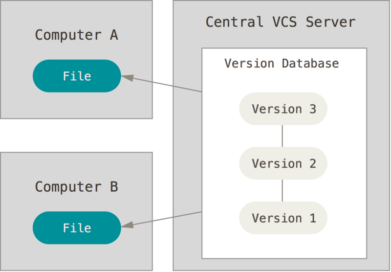

# 版本控制

版本控制工具

## 目录

* [git](git/README.md)

## 概述

版本控制是一种记录一个或若干文件内容变化，以便将来查阅特定版本修订情况的系统

### 本地版本控制系统

在硬盘上保存补丁集，通过应用所有的补丁，重新计算出各个版本的文件内容

### 集中式版本控制系统

有一个单一的集中管理的服务器，保存所有文件的修订版本，而协同工作的人们都通过客户端连到这台服务器，取出最新的文件或者提交更新

### 分布式版本控制系统

客户端并不只提取最新版本的文件快照，而是把代码仓库完整地镜像下来

