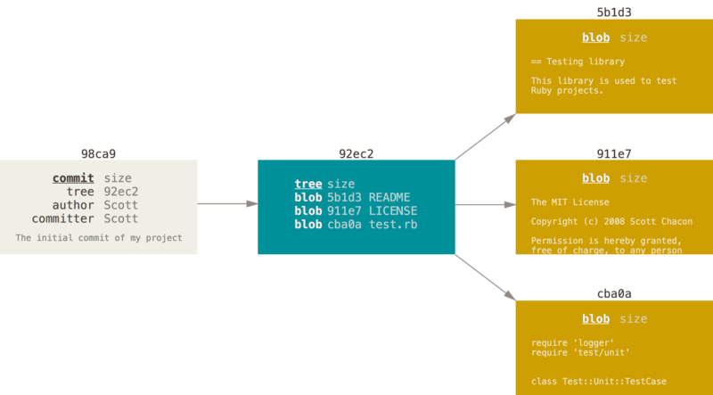

# 分支

## 概念

### 提交对象

### 提交链

### 本地分支

### 远程分支

## 命令

### 查看分支

* `git branch`: 查看本地分支
* `git branch --merged`: 查看合并到当前分支的本地分支
* `git branch --no-merged`: 查看未合并到当前分支的本地分支
* `git branch -v`: 查看本地分支指向的提交
* `git branch -vv`: 查看本地分支指向提交，并显示跟踪的远程分支
* `git branch -r`: 查看远程分支
* `git branch -a`: 查看所有分支

### 创建分支

* `git branch <branch-name> <commit>`: 从某个提交开始创建本地分支
* `git branch <branch-name> <tag>`: 从标签指向的提交开始创建本地分支
* `git branch <branch-name> <local-branch>`: 从某个本地分支指向的提交开始创建本地分支
* `git branch <branch-name> <remote-branch>`: 从某个远程分支指向的提交开始创建本地分支，并跟踪该远程分支
* `git branch <branch-name>`: 从当前分支指向的提交开始创建本地分支

### 切换分支

* `git checkout <branch-name>`: 切换分支
* `git checkout -b <branch-name> <start-point>`: 从某个提交开始创建本地分支并切换到该分支
* `git checkout -b <branch-name>`: 从当前分支指向的提交开始创建本地分支并切换到该分支

### 重命名分支

* `git branch -m <current-name> <new-name>`

### 合并分支

* `git merge <branch-name> <other-branch>`: 合并分支到另一个分支
* `git merge <branch-name>`: 合并分支到当前分支
* `git merge --abort`: 中断合并
* `git mergetool --tool-help`: 查看可用的合并工具

### 变基分支

* `git rebase <base-branch> <branch-name>`: 将指定分支变基到基本分支上
* `git rebase <base-branch>`: 将当前分支变基到基本分支上

**注：**推送了的分支不要执行变基

### 删除分支

* `git branch -d <branch-name>`: 删除已合并到当前分支的本地分支
* `git branch -D <branch-name>`: 强制删除某个本地分支
* `git push <remote-name> :<remote-branch>`: 删除远程分支
* `git push <remote-name> --delete <remote-branch>`: 删除远程分支

### 跟踪远程分支

* `git branch -u  <remote-branch> <local-branch>`: 本地分支跟踪远程分支
* `git branch -u <remote-branch>`: 当前分支跟踪远程分支
* `git branch --unset-upstream <local-branch>`: 取消本地分支的跟踪
* `git branch --unset-upstream`: 取消当前分支的跟踪