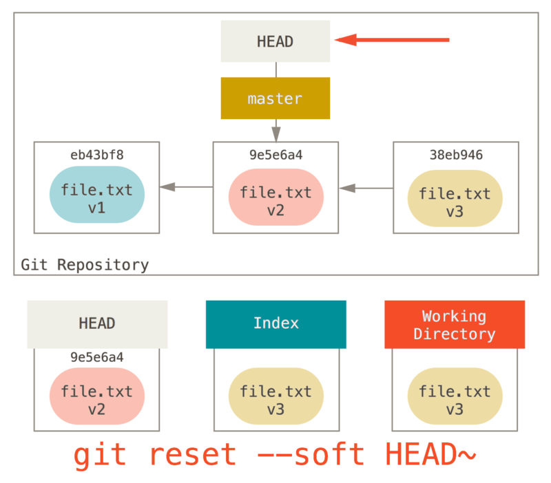
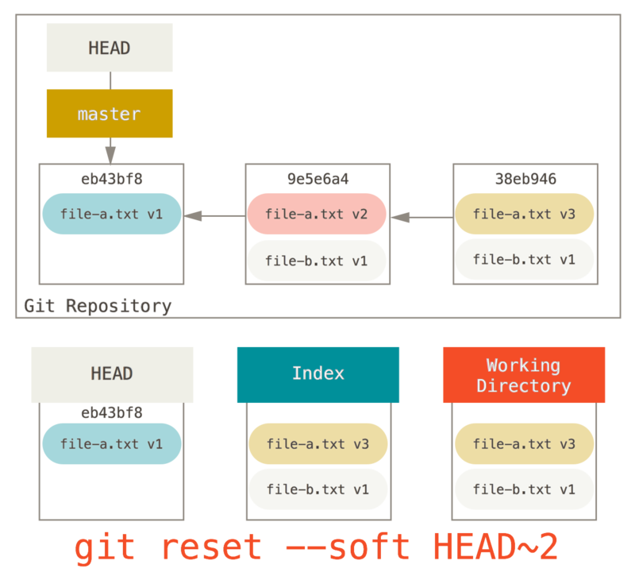

# 基本命令

## 帮助

* `git <command> --help`: 帮助文档
* `git <command> -h`: 帮助

## 获取Git仓库

* `git init`: 当前目录初始化git仓库
* `git init <dir>`: 指定目录初始化git仓库
* `git clone <repo>`: 当前目录克隆git仓库
* `git clone <repo> <dir>`: 指定目录克隆git仓库
* `git clone -b <branch-name> <repo>`: 指定克隆分支
* `git clone -o <remote-name> <repo>`: 指定远程仓库名
* `git clone -c <key=value> <repo>`: 指定仓库配置

## 工作目录状态

* `git status`: 当前工作目录状态
* `git status -s`: 当前工作目录的简要状态
  * ?? 未跟踪文件
  * A 跟踪新文件
  * _M 已修改但未暂存
  * M_ 修改并暂存
  * MM 暂存但又修改了
  * AM 跟踪新文件但又修改了
  * _D 删除文件但未暂存
  * D_ 删除文件并暂存
  * _R 重命名文件但未暂存
  * R_ 重命名文件并暂存

## 比较

* `git diff`: 比较工作目录和暂存区
* `git diff <path...>`: 比较工作目录和暂存区的某些文件
* `git diff --cached`: 比较暂存区和本地仓库
* `git diff --cached <path...>`: 比较暂存区和本地仓库的某些文件
* `git diff --staged`: 比较暂存区和本地仓库
* `git diff HEAD`: 比较工作目录和本地仓库
* `git diff HEAD <path...>`: 比较工作目录和本地仓库的某些文件
* `git diff <commit>`: 比较工作目录和某个提交
* `git diff <commit> <path...>`: 比较工作目录和某个提交的某些文件

## 搜索

* `git grep <text>`: 在工作目录中搜索
* `git grep -n <text>`: 显示行号
* `git grep --count <text>`: 显示数目
* `git grep --break <text>`: 不同文件空行隔开
* `git grep --heading <text>`: 以文件划分

## 暂存

* `git add <path...>`: 跟踪新文件或暂存已修改的文件
* `git add .`: 跟踪本目录下的新文件或暂存本目录下的已修改文件
* `git add --all`: 跟踪所有新文件或暂存所有已修改的文件
* `git add -p`: 暂存文件的一部分
* `git add -i`: 进入暂存交互界面
* `git rm <path...>`: 删除文件并暂存
* `git rm --cached <path...>`: 删除暂存区的文件
* `git mv <target> <destination>`: 重命名文件并暂存

## 储藏

* `git stash`: 储藏跟踪的修改和暂存
* `git stash -u`: 储藏未跟踪的修改
* `git stash -all`: 储藏所有修改和暂存
* `git stash --keep-index`: 储藏未暂存的跟踪的修改
* `git stash --patch`: 选择要储藏的改动
* `git stash list`: 查看储藏
* `git stash show stash@{<n>}`: 查看某个储藏
* `git stash apply stash@{<n>}`: 应用某个储藏的修改
* `git stash apply`: 应用最近储藏的修改
* `git stash apply --index stash@{<n>}`: 应用某个储藏的暂存
* `git stash apply --index`: 应用最近储藏的暂存
* `git stash drop stash@{<n>}`: 移除某个储藏
* `git stash pop`: 移除最近的储藏
* `git stash branch <branch-name> stash@{<n>}`: 新建本地分支，并应用某个储藏，应用成功后移除储藏
* `git stash branch <branch-name>`: 新建本地分支，并应用最近的储藏，应用成功后移除储藏

## 清理

* `git clean`: 移除未忽略未跟踪的文件
* `git clean -x`: 移除所有未跟踪的文件
* `git clean -d`: 移除未忽略未跟踪的文件和空目录
* `git clean -i`: 交互模式
* `git clean -n`: 移除预演

## 提交

* `git commit`: 启动配置的编辑器输入提交信息并提交
* `git commit -m '<message>'`: 指定提交信息并提交
* `git commit -a`: 暂存所有已跟踪的文件并提交
* `git commit --amend`: 修改最后一次提交

## 提交信息

* `git show <commit>`: 显示某个提交的详细信息
* `git show <branch-name>`: 显示某个分支指向的提交的详细信息
* `git show <tag>`: 显示某个标签指向的提交的详细信息
* `git show <commit>~`: 显示某个提交的父提交的详细信息
* `git show <commit>~<n>`: 显示某个提交的n代祖先提交的详细信息

## 回滚

* `git reset --soft <commit>`: 当前分支指向commit



* `git reset --mixed <commit>`: 当前分支指向commit，并用commit的文件快照覆盖暂存区


* `git reset --hard <commit>`: 当前分支指向commit，并用coomit的文件快照覆盖暂存区，再用暂存区的文件快照覆盖工作目录


* `git reset <commit> <path>`: 使用commit中的指定文件快照覆盖暂存区对应的文件


## 合并提交

```
git reset --soft HEAD~2
git commit -m '合并提交'
```




## 检出

* `git checkout <branch>`: HEAD指向分支


* `git checkout <commit> -- <file>`: 使用commit的文件快照覆盖暂存区和工作目录
* `git checkout -- <file>`: 使用当前分支的文件快照覆盖暂存区和工作目录

## 提交历史

* `git log`: 显示提交历史
* `git log -p`: 显示每次提交的详细更改信息
* `git log --stat`: 显示每次提交的简要更改信息
* `git log --graph`: 图表显示
* `git log --decorate`: 显示提交和分支
* `git log --abbrev-commit`: 显示简短的SHA-1值
* `git log --pretty=<format>`: 指定显示的格式
  * `oneline` 一行显示commit, message
  * `short` 分行显示commit, Author, message
  * `full` 分行显示commit, Author, Commit, message
  * `fuller` 分行显示commit, Author, AuthorDate, Commit, CommitDate, message
  * `format: <options>` 自定义格式
    * `%H|%h` commit的完整|简短哈希字符串
    * `%T|%t` tree的完整|简短哈希字符串
    * `%P|%p` parent的完整|简短哈希字符串
    * `%an|%ae|%ad|%ar` 作者名字|邮箱|提交日期(--date= 时间格式)|提交日期(按多久以前的方式显示)
    * `%cn|%ce|%cd|%cr` 提交者名字|邮箱|提交日期(--date= 时间格式)|提交日期(按多久以前的方式显示)
    * `%s` message
* `git log <filter>` 筛选提交历史
  * `-<n>` 仅显示最近的 n 条提交
  * `--since|--after` 仅显示指定时间之后的提交
  * `--until|--before` 仅显示指定时间之前的提交
  * `--author` 仅显示指定作者相关的提交
  * `--committer` 仅显示指定提交者相关的提交
  * `--grep` 仅显示含指定关键字的提交
  * `--no-merges` 仅显示未合并的提交
  * `--all-match` 满足所有条件的提交
* 显示提交区间
  * `git log <branch1>..<branch2>`: 显示branch1没有而branch2有的提交
  * `git log <branch1>...<branch2>`: 显示branch1和branch2不共有的提交
  * `git log <branch1...> --not <branch>`: 显示branch1...有而branch没有的提交
* 修改提交历史
  * `git rebase -i <commit>`: 修改提交历史
  * `git filter-branch`: 批量修改提交历史

## 标签

* `git tag`: 显示所有标签
* `git tag <tag>`: 给当前分支指向的提交创建轻量标签
* `git tag -a <tag> -m "<message>" <commit>`: 给指定提交创建附注标签
* `git tag -a <tag> -m "<message>"`: 给当前分支指向的提交创建附注标签
* `git tag -d <tag>`: 删除标签
* `git push <remote-name> <tag>`: 推送某个标签
* `git push <remote-name> --tags`: 推送所有标签

## 远程仓库

* `git remote`: 远程仓库名
* `git remote -v`: 远程仓库名和url
* `git remote show <remote-name>`: 显示远程仓库的详细信息
* `git remote add <remote-name> <repo>`: 添加远程仓库
* `git remote rm <remote-name>`: 移除远程仓库
* `git remote rename <remote-name1> <remote-name2>`: 重命名远程仓库
* `git remote set-url <remote-name> <url>`: 修改远程仓库的url
* `git fetch <remote-name>`: 抓取远程仓库所有分支的数据
* `git fetch`: 抓取origin仓库所有分支的数据
* `git fetch --all`: 抓取所有远程仓库所有分支的数据
* `git fetch <remote-name> <remote-branch>`: 抓取远程仓库某个分支的数据
* `git pull <remote-name> <remote-branch>:<local-branch>`: 抓取远程仓库某个分支的数据，并合并到本地仓库的某个分支
* `git pull <remote-name> <remote-branch>`: 抓取远程仓库某个分支的数据，并合并到当前分支
* `git pull <remote-name>`: 抓取当前分支跟踪的远程分支，并合并到当前分支
* `git pull`: 抓取当前分支唯一跟踪的远程分支，并合并到当前分支
* `git push <remote-name> <local-branch>:<remote-branch>`: 将本地分支推送到远程分支
* `git push -u <remote-name> <local-branch>:<remote-branch>`: 将本地分支推送到远程分支，并跟踪远程分支
* `git push <remote-name> <local-branch>`: 将本地分支推送到跟踪的远程分支
* `git push <remote-name>`: 将当前分支推送到跟踪的远程分支
* `git push`: 将当前分支推送到唯一跟踪的远程分支

## gui界面

* `gitk -all`: 界面显示所有提交历史
* `git gui`: 打开gui界面