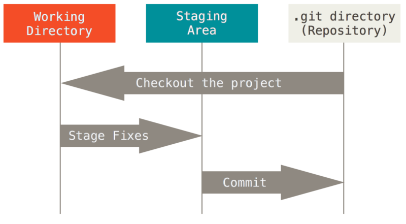

# 概念

## 工作区域

* 工作目录：本地工作的地方
* 暂存区域：暂存修改的文件快照
* 本地仓库：存储提交对象
* 远程仓库：推送或抓取数据

## 工作流程

1\. 修改文件：在工作目录中修改文件

2\. 暂存文件：将修改的文件添加到暂存区域

3\. 提交更新：将暂存区域的快照存储到本地仓库中

4\. 远程交互：将本地提交推送到远程仓库或从远程仓库获取提交

## 文件状态

* 未跟踪：未纳入git管理
* 已跟踪：已纳入git管理
  * 未修改：未做修改
  * 已修改：作了修改但还未添加到暂存区域
  * 已暂存：作了修改并添加到暂存区域

## 模式

* 命令行：使用命令行操作Git
* GUI：使用GUI界面操作Git