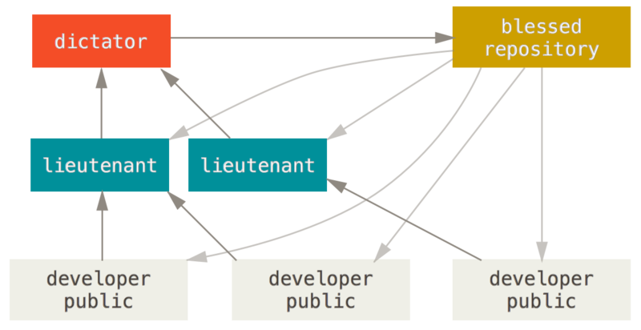

# Git

分布式版本控制系统

## 目录

## 参考资料

* [git-book](https://github.com/ninghao/git-book)
* [Pro Git](https://bingohuang.gitbooks.io/progit2/content/)


# 特点

## 直接记录快照，而非差异比较

差异流


快照流


## 近乎所有操作都是本地执行

本地磁盘上上有项目的完整历史，所以绝大多数操作都在本地进行


# 概念

## 工作区域

* Git仓库目录：本地仓库
* 工作目录：项目的某个快照
* 暂存区域：保存了下次将提交的文件快照


## 工作流程

1. 修改文件：在工作目录中修改文件
2. 暂存文件：将修改的文件添加到暂存区域
3. 提交更新：将暂存区域的快照永久性存储到本地仓库中

## 文件状态

* 未跟踪：未纳入git管理
* 已跟踪：已纳入git管理
  * 未修改：未做修改
  * 已修改：作了修改但还未添加到暂存区域
  * 已暂存：作了修改并添加到暂存区域


## 模式

* 命令行：使用命令行操作Git
* GUI：使用GUI界面操作Git


# 安装

## 在windows上安装

有几种安装方法

* 安装[cmder](http://cmder.net/)的full版本
* 安装[msysgit](https://git-for-windows.github.io/)
* 安装[GitHub for Windows](https://desktop.github.com/)


# 配置

## 优先级

下一级别覆盖上一级别

* /etc/config: 当前系统配置(git目录下)
* ~/.gitconfig或~/.config/git/config: 当前用户配置
* .git/config: 当前仓库配置

## 配置命令

```
usage: git config [<options>]

Config file location
    --global              use global config file
    --system              use system config file
    --local               use repository config file
    -f, --file <file>     use given config file
    --blob <blob-id>      read config from given blob object

Action
    --get                 get value: name [value-regex]
    --get-all             get all values: key [value-regex]
    --get-regexp          get values for regexp: name-regex [value-regex]
    --get-urlmatch        get value specific for the URL: section[.var] URL
    --replace-all         replace all matching variables: name value [value_regex]
    --add                 add a new variable: name value
    --unset               remove a variable: name [value-regex]
    --unset-all           remove all matches: name [value-regex]
    --rename-section      rename section: old-name new-name
    --remove-section      remove a section: name
    -l, --list            list all
    -e, --edit            open an editor
    --get-color           find the color configured: slot [default]
    --get-colorbool       find the color setting: slot [stdout-is-tty]

Type
    --bool                value is "true" or "false"
    --int                 value is decimal number
    --bool-or-int         value is --bool or --int
    --path                value is a path (file or directory name)

Other
    -z, --null            terminate values with NUL byte
    --name-only           show variable names only
    --includes            respect include directives on lookup
    --show-origin         show origin of config (file, standard input, blob, command line)
```

## 常用命令

* `git config --system`: 当前系统配置
* `git config --global`: 当前用户配置
* `git config`: 当前仓库配置
* `git config -l`: 查看所有配置
* `git config -e`: 编辑配置文件

## 常用配置

### 全局用户名和邮箱

* `git config --global user.name "<username>"`: 配置全局用户名
* `git config --global user.email <useremail>`: 配置全局用户邮箱

### 全局编辑器

* `git config --global core.editor <editor>`: 配置全局编辑器(editor为启动编辑器的命令)

### 别名

* `git config --global alias.st status`
* `git config --global alias.ci commit`
* `git config --global alias.br branch`
* `git config --global alias.co checkout`
* `git config --global alias.unstage 'reset HEAD'`
* `git config --global alias.undo 'checkout --'`
* `git config --global alias.last 'log -1'`
* `git conifg --global alias.lg 'log --color --graph --pretty=format:'%Cred%h%Creset -%C(yellow)%d%Creset %s %Cgreen(%cr) %C(bold blue)<%an>%Cre'`


# 忽略文件

在.gitignore中列出要忽略的文件

## 规范

* 忽略空行和`#`开头的行
* 采用glob模式匹配
  * `*`: 匹配零个或任意个字符
  * `**`: 匹配任意中间目录
  * `?`: 匹配一个字符
  * `[]`: 匹配括号内的某一个字符
* `/`开头防止递归
* `/`结尾指定目录
* `!`表示不忽略


# 基本命令


## 帮助

* `git help <command>`: 帮助文档

## 获取Git仓库

* `git init`: 当前目录初始化git仓库
* `git init <dir>`: 指定目录初始化git仓库
* `git clone <repo>`: 当前目录克隆git仓库
* `git clone <repo> <dir>`: 指定目录克隆git仓库
* `git clone -b <branch-name> <repo>`: 克隆指定分支
* `git clone -o <remote-name> <repo>`: 设置远程仓库名
* `git clone -c <key=value> <repo>`: 设置仓库配置

## 工作目录状态

* `git status`: 当前工作目录状态
* `git status -s`: 当前工作目录的简要状态
  * ?? 未跟踪文件
  * A 跟踪新文件
  * _M 已修改但未暂存
  * M_ 修改并暂存
  * MM 暂存但又修改了
  * AM 跟踪新文件但又修改了
  * _D 删除文件但未暂存
  * D_ 删除文件并暂存
  * _R 重命名文件但未暂存
  * R_ 重命名文件并暂存

## 比较

* `git diff`: 比较工作目录和暂存区
* `git diff <path...>`: 比较工作目录和暂存区的某些文件
* `git diff --cached`: 比较暂存区和本地仓库
* `git diff --cached <path...>`: 比较暂存区和本地仓库的某些文件
* `git diff --staged`: 比较暂存区和本地仓库
* `git diff HEAD`: 比较工作目录和本地仓库
* `git diff HEAD <path...>`: 比较工作目录和本地仓库的某些文件

## 暂存

* `git add <path...>`: 跟踪新文件或暂存已修改的文件
* `git add .`: 跟踪本目录下的新文件或暂存本目录下的已修改文件
* `git add -A`: 跟踪所有新文件或暂存所有已修改的文件
* `git rm <path...>`: 删除文件并暂存
* `git rm --cached <path...>`: 删除暂存区的文件
* `git mv <target> <destination>`: 重命名文件并暂存

## 撤销

* `git reset HEAD <file>`: 撤销暂存文件
* `git checkout -- <file>`: 撤销修改文件

## 提交

* `git commit`: 启动配置的编辑器输入提交信息并提交
* `git commit -m '<message>'`: 指定提交信息并提交
* `git commit -a`: 暂存所有已跟踪的文件并提交
* `git commit --amend`: 合并进上次提交

## 提交历史

* `git log`: 显示提交历史
* `git log -p`: 显示每次提交的详细更改信息
* `git log --stat`: 显示每次提交的简要更改信息
* `git log --graph`: 图表显示
* `git log --decorate`: 显示提交和分支
* `git log --abbrev-commit`: 显示简短的SHA-1值
* `git log --pretty=<format>`: 指定显示的格式
  * `oneline` 一行显示commit, message
  * `short` 分行显示commit, Author, message
  * `full` 分行显示commit, Author, Commit, message
  * `fuller` 分行显示commit, Author, AuthorDate, Commit, CommitDate, message
  * `format: <options>` 自定义格式
    * `%H|%h` commit的完整|简短哈希字符串
    * `%T|%t` tree的完整|简短哈希字符串
    * `%P|%p` parent的完整|简短哈希字符串
    * `%an|%ae|%ad|%ar` 作者名字|邮箱|提交日期(--date= 时间格式)|提交日期(按多久以前的方式显示)
    * `%cn|%ce|%cd|%cr` 提交者名字|邮箱|提交日期(--date= 时间格式)|提交日期(按多久以前的方式显示)
    * `%s` message
* `git log <filter>` 筛选提交历史
  * `-<n>` 仅显示最近的 n 条提交
  * `--since|--after` 仅显示指定时间之后的提交
  * `--until|--before` 仅显示指定时间之前的提交
  * `--author` 仅显示指定作者相关的提交
  * `--committer` 仅显示指定提交者相关的提交
  * `--grep` 仅显示含指定关键字的提交
  * `--no-merges` 仅显示未合并的提交
  * `--all-match` 满足所有条件的提交
* 显示提交区间
  * `git log <branch1>..<branch2>`: 显示branch1没有而branch2有的分支

## 标签

* `git tag`: 显示所有标签
* `git tab <tag>`: 创建轻量标签
* `git tab -a <tag> -m "<message>"`: 创建附注标签
* `git tab -a <tag> <commit>`: 给指定提交创建附注标签
* `git push <remote-name> <tag>`: 推送某个标签
* `git push <remote-name> --tags`: 推送所有标签

## 提交信息

* `git show <commit>`: 显示某个提交的详细信息
* `git show <branch-name>`: 显示某个分支指向的提交的详细信息
* `git show <tag>`: 显示某个标签指向的提交的详细信息
* `git show <some-commit>~`: 显示某个提交的父提交的详细信息
* `git show <some-commit>~<n>`: 显示某个提交的n代祖先提交的详细信息


## 远程仓库

* `git remote`: 远程仓库名
* `git remote -v`: 远程仓库名和url
* `git remote show <remote-name>`: 显示远程仓库的详细信息
* `git remote add <remote-name> <repo>`: 添加远程仓库
* `git remote rm <remote-name>`: 移除远程仓库
* `git remote rename <remote-name1> <remote-name2>`: 重命名远程仓库
* `git fetch <remote-name>`: 抓取远程仓库所有分支的数据
* `git fetch`: 抓取origin仓库所有分支的数据
* `git fetch <remote-name> <remote-branch>`: 抓取远程仓库某个分支的数据
* `git pull <remote-name> <remote-branch>:<local-branch>`: 抓取远程仓库某个分支的数据，并合并到本地仓库的某个分支
* `git pull <remote-name> <remote-branch>`: 抓取远程仓库某个分支的数据，并合并到当前分支
* `git pull <remote-name>`: 抓取当前分支跟踪的远程分支，并合并到当前分支
* `git pull`: 抓取当前分支唯一跟踪的远程分支，并合并到当前分支
* `git push <remote-name> <local-branch>:<remote-branch>`: 将本地分支推送到远程分支
* `git push -u <remote-name> <local-branch>:<remote-branch>`: 将本地分支推送到远程分支，并跟踪远程分支
* `git push <remote-name> <local-branch>`: 将本地分支推送到跟踪的远程分支
* `git push <remote-name>`: 将当前分支推送到跟踪的远程分支
* `git push`: 将当前分支推送到唯一跟踪的远程分支

# 分支

## 概念

### 提交对象


### 提交链


### 本地分支


### 远程分支


## 命令

### 查看分支

* `git branch`: 查看本地分支
* `git branch --merged`: 查看合并到当前分支的本地分支
* `git branch --no-merged`: 查看未合并到当前分支的本地分支
* `git branch -v`: 查看本地分支的指向的提交
* `git branch -vv`: 查看本地分支的指向提交，并显示跟踪的远程分支
* `git branch -r`: 查看远程分支
* `git branch -a`: 查看所有分支

### 创建分支

* `git branch <branch-name> <commit>`: 从某个提交开始创建本地分支
* `git branch <branch-name> <tag>`: 从标签指向的提交开始创建本地分支
* `git branch <branch-name> <local-branch>`: 从某个本地分支指向的提交开始创建本地分支
* `git branch <branch-name> <remote-branch>`: 从某个远程分支指向的提交开始创建本地分支，并跟踪该远程分支
* `git branch <branch-name>`: 从当前分支指向的提交开始创建本地分支


### 切换分支

* `git checkout <branch-name>`: 切换分支
* `git checkout -b <branch-name> <start-point>`: 从某个提交开始创建本地分支并切换到该分支
* `git checkout -b <branch-name>`: 从当前分支指向的提交开始创建本地分支并切换到该分支


### 重命名分支

* `git branch -m <current-name> <new-name>`

### 合并分支

* `git merge <branch-name> <other-branch>`: 合并分支到另一个分支
* `git merge <branch-name>`: 合并分支到当前分支


### 变基分支

* `git rebase <base-branch> <branch-name>`: 将指定分支变基到基本分支上
* `git rebase <base-branch>`: 将当前分支变基到基本分支上

注：不要对在你的仓库外有副本的分支执行变基


### 删除分支

* `git branch -d <branch-name>`: 删除已合并到当前分支的本地分支
* `git branch -D <branch-name>`: 强制删除某个本地分支
* `git push <remote-name> :<remote-branch>`: 删除远程分支
* `git push <remote-name> --delete <remote-branch>`: 删除远程分支

### 跟踪远程分支

* `git branch -u <local-branch> <remote-branch>`: 本地分支跟踪远程分支
* `git branch -u <remote-branch>`: 当前分支跟踪远程分支


# 工作流

## 集中式工作流


## 集中管理者工作流


## 司令官与副官工作流




# 服务器Git

* 本地协议： 基于共享文件系统
* HTTP协议：推送时需要授权
* SSH协议: 授权访问
* Git协议: 无授权访问


# GitHub

Git托管平台

## 注册

1. 访问<https://github.com>, 进行注册
2. 依次点击`settings/Profile`，修改个人信息
3. 依次点击`settings/Email`，修改邮件地址
3. 依次点击`settings/Notifications`，修改通知方式

## 派生项目

1. 找到想要派生的GitHub项目，点击`Fork`按钮，会在自己的Github上创建一个副本仓库
2. 克隆仓库到本地
3. 创建新的分支，在该分支上进行修改，并推送到仓库中
4. 点击`Pull Request`按钮，将合并请求发送给项目的拥有者

## 维护项目

创建、维护和管理自己的项目

### 创建版本库

点击`New respository`按钮，填写版本库信息

### 访问版本库

#### HTTP访问

使用`https://github.com/<username>/<repo>`地址访问版本库

#### SSH访问

1. 执行`ssh-genkey`命令，生成`id_rsa`私钥，`id_rsa.pub`公钥的密钥对
2. 访问<https://github.com>，依次点击`settings/SSH and GPG keys/New SSH Key`，Key中填写id_rsa.pub的内容
3. 使用`git@github.com:<username>/<repo>`地址访问版本库

### 添加合作者

进入项目页，依次点击`settings/Collaborators`，添加合作者

## 管理组织

1. 点击`New organization`，创建组织
2. 管理团队成员及版本库权限