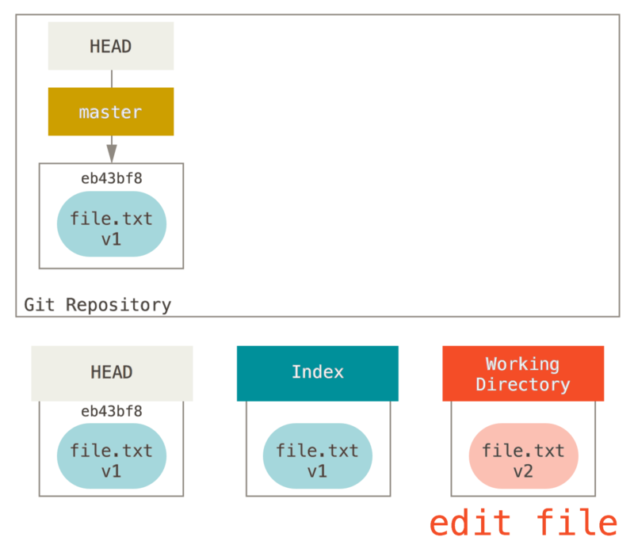
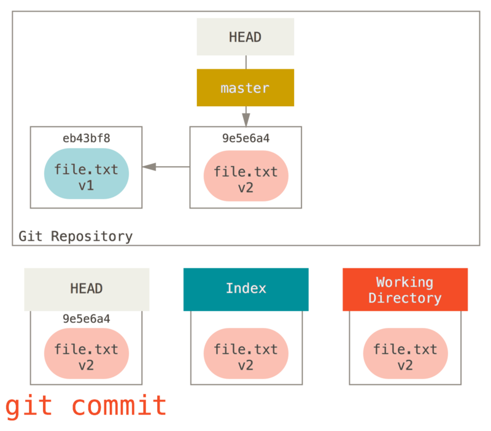
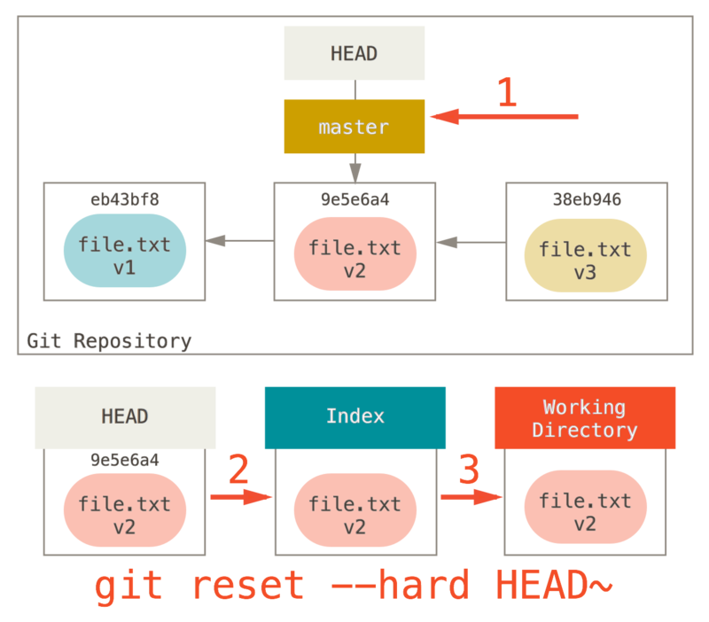
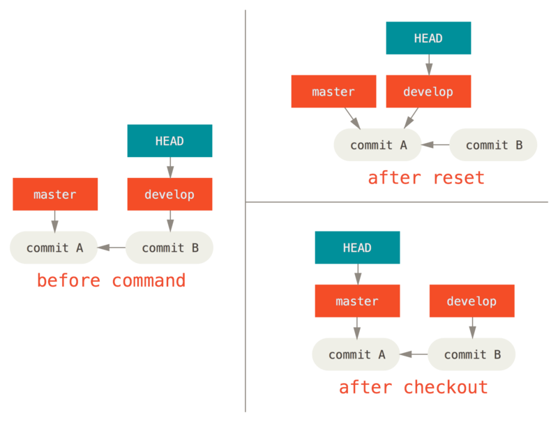
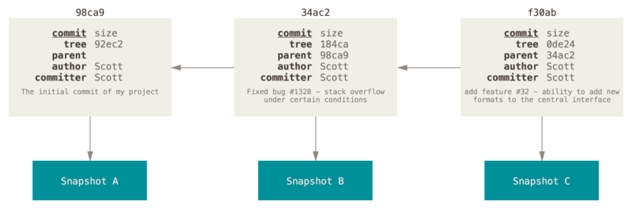
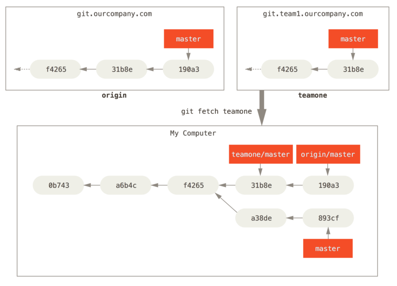

# Git

分布式版本控制系统

## 目录

## 参考资料

* [git-book](https://github.com/ninghao/git-book)
* [Pro Git](https://bingohuang.gitbooks.io/progit2/content/)


# 特点

## 直接记录快照，而非差异比较

差异流


快照流


## 近乎所有操作都是本地执行

本地磁盘上上有项目的完整历史，所以绝大多数操作都在本地进行


# 概念

## 工作区域

* 工作目录：本地工作的地方
* 暂存区域：暂存修改的文件快照
* 本地仓库：存储提交对象
* 远程仓库：推送或抓取数据


## 工作流程

1. 修改文件：在工作目录中修改文件



2. 暂存文件：将修改的文件添加到暂存区域


3. 提交更新：将暂存区域的快照存储到本地仓库中



4. 远程交互：将本地提交推送到远程仓库或从远程仓库获取提交


## 文件状态

* 未跟踪：未纳入git管理
* 已跟踪：已纳入git管理
  * 未修改：未做修改
  * 已修改：作了修改但还未添加到暂存区域
  * 已暂存：作了修改并添加到暂存区域


## 模式

* 命令行：使用命令行操作Git
* GUI：使用GUI界面操作Git


# 安装

## 在windows上安装

有几种安装方法

* 安装[cmder](http://cmder.net/)的full版本
* 安装[msysgit](https://git-for-windows.github.io/)
* 安装[GitHub for Windows](https://desktop.github.com/)


# 配置

## 优先级

下一级别覆盖上一级别

* git目录/etc/config: 当前系统配置
* ~/.gitconfig或~/.config/git/config: 当前用户配置
* 当前仓库目录/.git/config: 当前仓库配置

## 配置命令

* `git config --system`: 当前系统配置
* `git config --global`: 当前用户配置
* `git config`: 当前仓库配置
* `git config -l`: 查看所有配置
* `git config -e`: 编辑配置文件

## 常用配置

### 用户名和邮箱

* `git config --global user.name "<username>"`: 设置用户名
* `git config --global user.email <useremail>`: 设置邮箱

### 文本编辑器

* `git config --global core.editor <editor>`: 设置文本编辑器(editor为启动编辑器的命令)，默认为vi

### 分页器

* `git config --global core.pager ['' | less | more]`: 设置分页器，默认为less

### 忽略文件

* `git config --global core.excludesfile <file>`: 设置全局忽略文件

### 提交信息模板

* `git config --global commit.template <file>`: 设置提交信息模板

### 着色

* `git config --global color.ui [auto | false | always]`: 是否着色，默认为auto
* `git conifg --global color.[branch|diff|interactive|status] '<foreground background font>'`: 着什么色

### 合并和比较工具

### GPG签署密钥

* `git config --global user.signingkey <gpg-key-id>`: 设置GPG签署密钥

### 凭证

使用HTTP协议连接时，需要提供凭证，默认每次连接都询问用户名和密码

* `git config --global credential.helper cache --timeout <n>`: 将凭证存放到内存中一段时间
* `git config --global credential.helper --file <path>`: 将凭证明文存放到文件中

### SSH

使用SSH连接时，需要将本机的SSH公钥提供给git服务器，每次连接都不需凭证

1. 执行`ssh --gen-key`命令，生成SSH密钥对
2. 将SSH公钥提供给git服务器

### 别名

* `git config --global alias.st status`
* `git config --global alias.ci commit`
* `git config --global alias.br branch`
* `git config --global alias.co checkout`
* `git config --global alias.unstage 'reset HEAD'`
* `git config --global alias.undo 'checkout --'`
* `git config --global alias.last 'log -1'`
* `git conifg --global alias.lg 'log --color --graph --pretty=format:'%Cred%h%Creset -%C(yellow)%d%Creset %s %Cgreen(%cr) %C(bold blue)<%an>%Cre'`


# 忽略文件

在.gitignore中列出要忽略的文件

## 规范

* 忽略空行和`#`开头的行
* 采用glob模式匹配
  * `*`: 匹配零个或任意个字符
  * `**`: 匹配任意中间目录
  * `?`: 匹配一个字符
  * `[]`: 匹配括号内的某一个字符
* `/`开头防止递归
* `/`结尾指定目录
* `!`表示不忽略


# 基本命令

## 帮助

* `git <command> --help`: 帮助文档
* `git <command> -h`: 帮助

## 获取Git仓库

* `git init`: 当前目录初始化git仓库
* `git init <dir>`: 指定目录初始化git仓库
* `git clone <repo>`: 当前目录克隆git仓库
* `git clone <repo> <dir>`: 指定目录克隆git仓库
* `git clone -b <branch-name> <repo>`: 指定克隆分支
* `git clone -o <remote-name> <repo>`: 指定远程仓库名
* `git clone -c <key=value> <repo>`: 指定仓库配置

## 工作目录状态

* `git status`: 当前工作目录状态
* `git status -s`: 当前工作目录的简要状态
  * ?? 未跟踪文件
  * A 跟踪新文件
  * _M 已修改但未暂存
  * M_ 修改并暂存
  * MM 暂存但又修改了
  * AM 跟踪新文件但又修改了
  * _D 删除文件但未暂存
  * D_ 删除文件并暂存
  * _R 重命名文件但未暂存
  * R_ 重命名文件并暂存

## 比较

* `git diff`: 比较工作目录和暂存区
* `git diff <path...>`: 比较工作目录和暂存区的某些文件
* `git diff --cached`: 比较暂存区和本地仓库
* `git diff --cached <path...>`: 比较暂存区和本地仓库的某些文件
* `git diff --staged`: 比较暂存区和本地仓库
* `git diff HEAD`: 比较工作目录和本地仓库
* `git diff HEAD <path...>`: 比较工作目录和本地仓库的某些文件
* `git diff <commit>`: 比较工作目录和某个提交
* `git diff <commit> <path...>`: 比较工作目录和某个提交的某些文件

## 搜索

* `git grep <text>`: 在工作目录中搜索
* `git grep -n <text>`: 显示行号
* `git grep --count <text>`: 显示数目
* `git grep --break <text>`: 不同文件空行隔开
* `git grep --heading <text>`: 以文件划分

## 暂存

* `git add <path...>`: 跟踪新文件或暂存已修改的文件
* `git add .`: 跟踪本目录下的新文件或暂存本目录下的已修改文件
* `git add --all`: 跟踪所有新文件或暂存所有已修改的文件
* `git add -p`: 暂存文件的一部分
* `git add -i`: 进入暂存交互界面
* `git rm <path...>`: 删除文件并暂存
* `git rm --cached <path...>`: 删除暂存区的文件
* `git mv <target> <destination>`: 重命名文件并暂存

## 储藏

* `git stash`: 储藏跟踪的修改和暂存
* `git stash -u`: 储藏未跟踪的修改
* `git stash -all`: 储藏所有修改和暂存
* `git stash --keep-index`: 储藏未暂存的跟踪的修改
* `git stash --patch`: 选择要储藏的改动
* `git stash list`: 查看储藏
* `git stash show stash@{<n>}`: 查看某个储藏
* `git stash apply stash@{<n>}`: 应用某个储藏的修改
* `git stash apply`: 应用最近储藏的修改
* `git stash apply --index stash@{<n>}`: 应用某个储藏的暂存
* `git stash apply --index`: 应用最近储藏的暂存
* `git stash drop stash@{<n>}`: 移除某个储藏
* `git stash pop`: 移除最近的储藏
* `git stash branch <branch-name> stash@{<n>}`: 新建本地分支，并应用某个储藏，应用成功后移除储藏
* `git stash branch <branch-name>`: 新建本地分支，并应用最近的储藏，应用成功后移除储藏

## 清理

* `git clean`: 移除未忽略未跟踪的文件
* `git clean -x`: 移除所有未跟踪的文件
* `git clean -d`: 移除未忽略未跟踪的文件和空目录
* `git clean -i`: 交互模式
* `git clean -n`: 移除预演

## 提交

* `git commit`: 启动配置的编辑器输入提交信息并提交
* `git commit -m '<message>'`: 指定提交信息并提交
* `git commit -a`: 暂存所有已跟踪的文件并提交
* `git commit --amend`: 修改最后一次提交

## 提交信息

* `git show <commit>`: 显示某个提交的详细信息
* `git show <branch-name>`: 显示某个分支指向的提交的详细信息
* `git show <tag>`: 显示某个标签指向的提交的详细信息
* `git show <commit>~`: 显示某个提交的父提交的详细信息
* `git show <commit>~<n>`: 显示某个提交的n代祖先提交的详细信息

## 回滚

* `git reset --soft <commit>`: 当前分支指向commit


* `git reset --mixed <commit>`: 当前分支指向commit，并用commit的文件快照覆盖暂存区


* `git reset --hard <commit>`: 当前分支指向commit，并用coomit的文件快照覆盖暂存区，再用暂存区的文件快照覆盖工作目录



* `git reset <commit> <path>`: 使用commit中的指定文件快照覆盖暂存区对应的文件


## 合并提交

```
git reset --soft HEAD~2
git commit -m '合并提交'
```


## 检出

* `git checkout <branch>`: HEAD指向分支



* `git checkout <commit> -- <file>`: 使用commit的文件快照覆盖暂存区和工作目录
* `git checkout -- <file>`: 使用当前分支的文件快照覆盖暂存区和工作目录

## 提交历史

* `git log`: 显示提交历史
* `git log -p`: 显示每次提交的详细更改信息
* `git log --stat`: 显示每次提交的简要更改信息
* `git log --graph`: 图表显示
* `git log --decorate`: 显示提交和分支
* `git log --abbrev-commit`: 显示简短的SHA-1值
* `git log --pretty=<format>`: 指定显示的格式
  * `oneline` 一行显示commit, message
  * `short` 分行显示commit, Author, message
  * `full` 分行显示commit, Author, Commit, message
  * `fuller` 分行显示commit, Author, AuthorDate, Commit, CommitDate, message
  * `format: <options>` 自定义格式
    * `%H|%h` commit的完整|简短哈希字符串
    * `%T|%t` tree的完整|简短哈希字符串
    * `%P|%p` parent的完整|简短哈希字符串
    * `%an|%ae|%ad|%ar` 作者名字|邮箱|提交日期(--date= 时间格式)|提交日期(按多久以前的方式显示)
    * `%cn|%ce|%cd|%cr` 提交者名字|邮箱|提交日期(--date= 时间格式)|提交日期(按多久以前的方式显示)
    * `%s` message
* `git log <filter>` 筛选提交历史
  * `-<n>` 仅显示最近的 n 条提交
  * `--since|--after` 仅显示指定时间之后的提交
  * `--until|--before` 仅显示指定时间之前的提交
  * `--author` 仅显示指定作者相关的提交
  * `--committer` 仅显示指定提交者相关的提交
  * `--grep` 仅显示含指定关键字的提交
  * `--no-merges` 仅显示未合并的提交
  * `--all-match` 满足所有条件的提交
* 显示提交区间
  * `git log <branch1>..<branch2>`: 显示branch1没有而branch2有的提交
  * `git log <branch1>...<branch2>`: 显示branch1和branch2不共有的提交
  * `git log <branch1...> --not <branch>`: 显示branch1...
* 修改提交历史
  * `git rebase -i <commit>`: 修改提交历史
  * `git filter-branch`: 批量修改提交历史

## 标签

* `git tag`: 显示所有标签
* `git tag <tag>`: 创建轻量标签
* `git tag -a <tag> -m "<message>"`: 创建附注标签
* `git tag -a <tag> -m "<message>" <commit>`: 给指定提交创建附注标签
* `git tag -d <tag>`: 删除标签
* `git push <remote-name> <tag>`: 推送某个标签
* `git push <remote-name> --tags`: 推送所有标签

## 远程仓库

* `git remote`: 远程仓库名
* `git remote -v`: 远程仓库名和url
* `git remote show <remote-name>`: 显示远程仓库的详细信息
* `git remote add <remote-name> <repo>`: 添加远程仓库
* `git remote rm <remote-name>`: 移除远程仓库
* `git remote rename <remote-name1> <remote-name2>`: 
* `git remote set-url <remote-name> <url>`: 修改远程仓库的url
* `git fetch <remote-name>`: 抓取远程仓库所有分支的数据
* `git fetch`: 抓取origin仓库所有分支的数据
* `git fetch --all`: 抓取所有远程仓库所有分支的数据
* `git fetch <remote-name> <remote-branch>`: 抓取远程仓库某个分支的数据
* `git pull <remote-name> <remote-branch>:<local-branch>`: 抓取远程仓库某个分支的数据，并合并到本地仓库的某个分支
* `git pull <remote-name> <remote-branch>`: 抓取远程仓库某个分支的数据，并合并到当前分支
* `git pull <remote-name>`: 抓取当前分支跟踪的远程分支，并合并到当前分支
* `git pull`: 抓取当前分支唯一跟踪的远程分支，并合并到当前分支
* `git push <remote-name> <local-branch>:<remote-branch>`: 将本地分支推送到远程分支
* `git push -u <remote-name> <local-branch>:<remote-branch>`: 将本地分支推送到远程分支，并跟踪远程分支
* `git push <remote-name> <local-branch>`: 将本地分支推送到跟踪的远程分支
* `git push <remote-name>`: 将当前分支推送到跟踪的远程分支
* `git push`: 将当前分支推送到唯一跟踪的远程分支

# 分支

## 概念

### 提交对象


### 提交链



### 本地分支


### 远程分支



## 命令

### 查看分支

* `git branch`: 查看本地分支
* `git branch --merged`: 查看合并到当前分支的本地分支
* `git branch --no-merged`: 查看未合并到当前分支的本地分支
* `git branch -v`: 查看本地分支指向的提交
* `git branch -vv`: 查看本地分支指向提交，并显示跟踪的远程分支
* `git branch -r`: 查看远程分支
* `git branch -a`: 查看所有分支

### 创建分支

* `git branch <branch-name> <commit>`: 从某个提交开始创建本地分支
* `git branch <branch-name> <tag>`: 从标签指向的提交开始创建本地分支
* `git branch <branch-name> <local-branch>`: 从某个本地分支指向的提交开始创建本地分支
* `git branch <branch-name> <remote-branch>`: 从某个远程分支指向的提交开始创建本地分支，并跟踪该远程分支
* `git branch <branch-name>`: 从当前分支指向的提交开始创建本地分支


### 切换分支

* `git checkout <branch-name>`: 切换分支
* `git checkout -b <branch-name> <start-point>`: 从某个提交开始创建本地分支并切换到该分支
* `git checkout -b <branch-name>`: 从当前分支指向的提交开始创建本地分支并切换到该分支


### 重命名分支

* `git branch -m <current-name> <new-name>`

### 合并分支

* `git merge <branch-name> <other-branch>`: 合并分支到另一个分支
* `git merge <branch-name>`: 合并分支到当前分支
* `git merge --abort`: 中断合并
* `git mergetool --tool-help`: 查看可用的合并工具


### 变基分支

* `git rebase <base-branch> <branch-name>`: 将指定分支变基到基本分支上
* `git rebase <base-branch>`: 将当前分支变基到基本分支上

注：推送了的分支不要执行变基


### 删除分支

* `git branch -d <branch-name>`: 删除已合并到当前分支的本地分支
* `git branch -D <branch-name>`: 强制删除某个本地分支
* `git push <remote-name> :<remote-branch>`: 删除远程分支
* `git push <remote-name> --delete <remote-branch>`: 删除远程分支

### 跟踪远程分支

* `git branch -u  <remote-branch> <local-branch>`: 本地分支跟踪远程分支
* `git branch -u <remote-branch>`: 当前分支跟踪远程分支
* `git branch --unset-upstream <local-branch>`: 取消本地分支的跟踪
* `git branch --unset-upstream`: 取消当前分支的跟踪


# 签署

通过GPG来签署和验证工作

## GPG命令

* `gpg --gen-key`: 生成gpg密钥对
* `gpg --list-keys`: 查看gpg密钥对

## 配置

1. 本地执行`git config --global user.signingkey <pub>`命令，配置签署密钥
2. 将gpg公钥放入git服务器的GPG钥匙链中

## 常用命令

* `git tag -s`: 签署标签
* `git tag -v`: 验证签署标签
* `git commit -S`: 签署提交
* `git log --show-signature`: 签署提交历史
* `git pull --verify-signature`: pull时验证是否是有效签署提交
* `git merge --verify-signature`: merge时验证是否是有效签署提交
* `git merge -S`: 签署合并提交

# 工作流

## 集中式工作流


## 集中管理者工作流


## 司令官与副官工作流


# GitHub

Git托管平台

## 注册

1. 访问<https://github.com>, 进行注册
2. 依次点击`settings/Profile`，修改个人信息
3. 依次点击`settings/Email`，修改邮件地址
3. 依次点击`settings/Notifications`，修改通知方式

## 派生项目

1. 找到想要派生的GitHub项目，点击`Fork`按钮，会在自己的Github上创建一个副本仓库
2. 克隆仓库到本地
3. 创建新的分支，在该分支上进行修改，并推送到仓库中
4. 点击`Pull Request`按钮，将合并请求发送给项目的拥有者

## 维护项目

创建、维护和管理自己的项目

### 创建版本库

点击`New respository`按钮，填写版本库信息

### 访问版本库

#### HTTP访问

使用`https://github.com/<username>/<repo>`地址访问版本库

#### SSH访问

1. 执行`ssh-genkey`命令，生成`id_rsa`私钥，`id_rsa.pub`公钥的密钥对
2. 访问<https://github.com>，依次点击`settings/SSH and GPG keys/New SSH Key`，Key中填写id_rsa.pub的内容
3. 使用`git@github.com:<username>/<repo>`地址访问版本库

### 添加合作者

进入GitHub上的仓库页，依次点击`settings/Collaborators`，添加合作者

## 管理组织

1. 点击`New organization`，创建组织
2. 管理团队成员及版本库权限